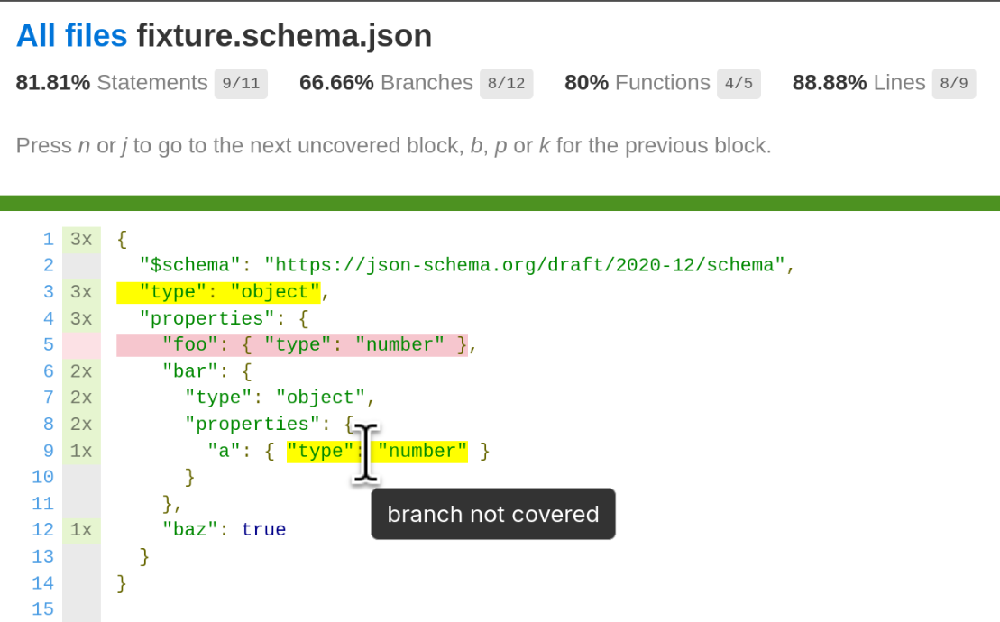

# Hyperjump - JSON Schema Test Coverage

This package provides test coverage support for JSON Schemas files in JSON and
YAML in your project. Integration is provided for Vitest, but the low level
components for collecting the coverage data is also exposed if you want to do
some other integration. It uses the [istanbul] coverage format, so you can
generate any reports that support [istanbul].

Validation is done by [@hyperjump/json-schema], so you can use any version of
JSON Schema, or provide your own custom keywords, vocabularies, and dialects.

```
-------------|---------|----------|---------|---------|-------------------
File         | % Stmts | % Branch | % Funcs | % Lines | Uncovered Line #s 
-------------|---------|----------|---------|---------|-------------------
All files    |   81.81 |    66.66 |      80 |   88.88 |                   
 schema.json |   81.81 |    66.66 |      80 |   88.88 | 5                 
-------------|---------|----------|---------|---------|-------------------
```



Istanbul reporters report in terms of Statements, Branches, and Functions, which
aren't terms that makes sense for JSON Schema. I've mapped those concepts to
what makes sense for schemas.

**Legend**
- **Statements** = Keywords
- **Branches** = true/false branches for each keyword (except for keywords that
  don't branch such as annotation-only keywords like `title` and `description`)
- **Functions** = Subschemas

## Limitations

The following are a list of known limitations. Some might be able to be
addressed at some point, while others might not.

- Keywords can pass/fail for multiple reasons, but not all branches are captured
  - Example: `type: ["object", "boolean"]`. If you test with an object and then
    test with a number, you've covered the pass and fail branches, but haven't
    tested that a boolean should also pass.
- There's currently no way to produce a report that uses JSON Schema-friendly
  terms rather than "statements" and "functions".

## Vitest

Integration with vitest is provided. You'll need a vitest config specifically
for running schema coverage. You can't run with coverage for both your js/ts
code and schema code at the same time.

By default, it will track coverage for any file with a `*.schema.json`,
`*.schema.yaml`, or `*.schema.yml` extension. You can change this with the
`include` option. For example, if you keep your schemas in a folder called
`schemas` and they just have plain extensions (`*.json`) instead of schema
extensions (`*.schema.json`), you could use `["schemas/**/*.json"]`.

If you use custom keywords, vocabularies, and dialects, you'll need to
register them with a [globalSetup](https://vitest.dev/config/#globalsetup)
script.

`vitest-schema.config.js`
```TypeScript
import { defineConfig } from "vitest/config";
import { jsonSchemaCoveragePlugin } from "@hyperjump/json-schema-coverage/vitest";

export default defineConfig({
  plugins: [jsonSchemaCoveragePlugin()],
  test: {
    globalSetup: ["./register-my-dialect.ts"], // Optional
    include: ["schema-tests/**/*.test.ts"], // Optional
    coverage: {
      include: ["schemas/**/*.json"] // Optional
    }
  }
});
```

```bash
vitest run --config=vitest-schema.config.js --coverage
```

When you use the provided custom matcher `matchJsonSchema`/`toMatchJsonSchema`,
if vitest has coverage enabled, it will collect coverage data from those tests.

```JavaScript
import { describe, expect, test } from "vitest";

describe("Worksheet", () => {
  test("matches with chai-style matcher", async () => {
    // 🚨 DON'T FORGET THE `await` 🚨
    await expect({ foo: 42 }).to.matchJsonSchema("./schema.json");
  });

  test("doesn't match with jest-style matcher", async () => {
    // 🚨 DON'T FORGET THE `await` 🚨
    await expect({ foo: null }).not.toMatchJsonSchema("./schema.json");
  });
});
```

Instead of referring to the file path, you can use `registerSchema` to register
the schema and then use its `$id`. Another reason to register a schema is if
your schema references external schema and you need to register those schemas
for the validation to work.

```JavaScript
import { describe, expect, test } from "vitest";
import { registerSchema, unregisterSchema } from "@hyperjump/json-schema-coverage/vitest";

describe("Worksheet", () => {
  beforeEach(async () => {
    await registerSchema("./schema.json");
  });

  afterEach(async () => {
    await unregisterSchema("./schema.json");
  });

  test("matches with jest-style matcher", async () => {
    // 🚨 DON'T FORGET THE `await` 🚨
    await expect({ foo: 42 }).toMatchJsonSchema("https://example.com/main");
  });

  test("doesn't match with chai-style matcher", async () => {
    // 🚨 DON'T FORGET THE `await` 🚨
    await expect({ foo: null }).not.to.matchJsonSchema("https://example.com/main");
  });
});
```

You can also use the matchers with inline schemas, but you only get coverage for
schemas from files in your code base.

```JavaScript
import { describe, expect, test } from "vitest";

describe("Worksheet", () => {
  test("matches with schema", async () => {
    // 🚨 DON'T FORGET THE `await` 🚨
    await expect("foo").to.matchJsonSchema({ type: "string" });
  });

  test("doesn't match with schema", async () => {
    // 🚨 DON'T FORGET THE `await` 🚨
    await expect(42).to.not.matchJsonSchema({ type: "string" });
  });
});
```

### Vitest API

These are the functions available when working with the vitest integration.

```JavaScript
import { ... } from "@hyperjump/json-schema-coverage/vitest"
```

- **jsonSchemaCoveragePlugin**: () => VitestPlugin

    A function that returns a Vitest plugin that registers matchers and sets up
    JSON Schema coverage if enabled.
- **matchJsonSchema**: (uriOrSchema: string | SchemaObject | boolean) => Promise\<void>

    A vitest matcher that can be used to validate a JSON-compatible value. It
    can take a relative or full URI for a schema in your codebase. Use relative
    URIs to reference a file and full URIs to reference the `$id` of a schema
    you registered using the `registerSchema` function.

    You can use this matcher with an inline schema as well, but you will only
    get coverage for schemas that are in files.
- **toMatchJsonSchema**: (uriOrSchema: string | SchemaObject | boolean) => Promise\<void>

    An alias for `matchJsonSchema` for those who prefer Jest-style matchers.
- **registerSchema**: (path: string) => Promise<void>

    Register a schema in your code base by it's path.

    _**NOTE**: This is **not** the same as the function from
    [@hyperjump/json-schema] that takes a schema._
- **unregisterSchema**: (path: string) => Promise<void>

    Remove a registered schema in your code base by it's path.

    _**NOTE**: This is **not** the same as the function from
    [@hyperjump/json-schema] that takes the schema's `$id`._

## Low-Level API

These are used internally. They can be used to get coverage without using the
Vitest integration.

```JavaScript
import { ... } from "@hyperjump/json-schema-coverage"
```

### CoverageMapService

The `CoverageMapService` creates [istanbul] coverage maps for your schemas and
stores them for use by the `TestCoverageEvaluationPlugin`. A coverage map stores
the file positions of all the keywords, schemas, and branches in a schema.

- **CoverageMapService.addFromFile** -- (schemaPath: string): Promise\<string>

    This method takes a file path to a schema, generates a coverage map for it,
    and stores it for later use. It returns the identifier for the schema
    (usually the value of `$id`).
- **CoverageMapService.addCoverageMap** -- (coverageMap: CoverageMapData): void

    If you have a coverage map you created yourself or got from some other
    source, you can add it using this method. You probably don't need this. Use
    `addFromFile` to create and store the coverage map for you.
- **CoverageMapService.getSchemaPath** -- (schemaUri: string): string

    Get the file path for the schema that is identified by the given URI.
- **CoverageMapService.getCoverageMap** -- (schemaUri: string): CoverageMapData

    Retrieve a coverage map that was previously added through `addFromFile` or
    `addCoverageMap`.

### TestCoverageEvaluationPlugin

The `TestCoverageEvaluationPlugin` hooks into the evaluation process of the
[@hyperjump/json-schema] validator and uses the `CoverageMapService` to record
when a keyword or schema is visited. Once the evaluation process is completed,
it contains an [istanbul] coverage file. These files can then be used to
generate any report that supports [istanbul]. See the following example for an
example of how to use the evaluation plugin.

### Nyc Example

The following is an example of using the Low-Level API to generate coverage
without Vitest. This uses [istanbul]'s [nyc] CLI to generate reports from the
coverage files that are generated.

Keep in mind that with the Low-Level API approach, you need to configure
[@hyperjump/json-schema] yourself. That means that you need to import the
dialects you need and will need to provide `MediaTypePlugin`s for anything other
than `*.schema.json` file extension support. YAML support is only provided
out-of-the-box for the Vitest integration.

Once you run the script, you can run the following command to generate a report.

```bash
npx nyc report --extension .schema.json
```

```TypeScript
import { randomUUID } from "node:crypto";
import { existsSync } from "node:fs";
import { mkdir, rm, writeFile } from "node:fs/promises";
import { validate } from "@hyperjump/json-schema/draft-2020-12";
import { BASIC } from "@hyperjump/json-schema/experimental";
import {
  CoverageMapService,
  TestCoverageEvaluationPlugin
} from "@hyperjump/json-schema-coverage";

const schemaUnderTest = `scratch/foo.schema.json`;

// Tell the CoverageMapService which schemas we want coverage for.
const coverageService = new CoverageMapService();
await coverageService.addFromFile(schemaUnderTest);

const validateFoo = await validate(schemaUnderTest);

// A function to run tests and write coverage files where nyc expects them.
const test = async (instance: any, valid: boolean) => {
  // Validate with the TestCoverageEvaluationPlugin
  const testCoveragePlugin = new TestCoverageEvaluationPlugin(coverageService);
  const output = validateFoo(instance, {
    outputFormat: BASIC,
    plugins: [testCoveragePlugin]
  });

  // Write the coverage file
  const filePath = `.nyc_output/${randomUUID()}.json`;
  await writeFile(filePath, JSON.stringify(testCoveragePlugin.coverage));

  // Report failures
  if (output.valid !== valid) {
    const instanceJson = JSON.stringify(instance, null, "  ");
    const outputJson = JSON.stringify(output, null, "  ");
    console.log("TEST FAILED:", instanceJson, "\nOUTPUT:", outputJson);
  }
};

// Initialize coverage directory
if (existsSync(".nyc_output")) {
  await rm(".nyc_output", { recursive: true });
}
await mkdir(".nyc_output");

// Run the tests
await test({ foo: 42 }, true);
await test({ foo: null }, false);
```

[@hyperjump/json-schema]: https://www.npmjs.com/package/@hyperjump/json-schema
[istanbul]: https://istanbul.js.org/
[nyc]: https://www.npmjs.com/package/nyc
